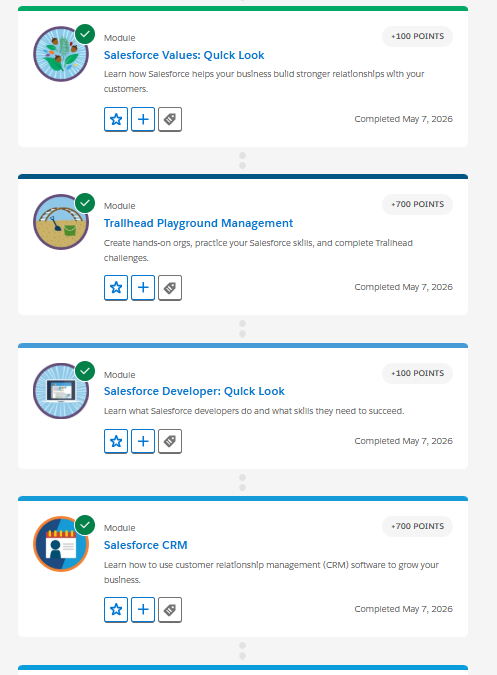

# Salesforce Fundamentals - Week 1, Day 2
## CRM Basics

### 1. What is CRM?
**CRM** stands for **Customer Relationship Management**. It is a technology for managing all your company's relationships and interactions with customers and potential customers. A CRM system helps companies stay connected to customers, streamline processes, improve profitability, and manage the entire business workflow efficiently.

### 2. Why companies use Salesforce?
Companies use Salesforce because it is a leading cloud-based CRM platform that provides comprehensive tools to manage customer interactions. Key reasons include:
- **Centralized Data**: Provides a 360-degree view of customers across sales, service, and marketing.
- **Cloud-Based**: Accessible from anywhere without needing physical servers.
- **Automation**: Streamlines business workflows and reduces manual tasks.
- **Scalability**: Can be customized and scaled as the business grows.
- **Analytics & Reporting**: Powerful dashboards to track the sales pipeline and team performance.

### 3. Core Salesforce Objects Explained
- **Account**: Represents a company or organization that you are doing business with (e.g., a business partner or a customer).
- **Contact**: Represents an individual person, usually associated with an Account (e.g., an employee of the company you are selling to).
- **Opportunity**: Represents a potential revenue-generating deal or a sale in progress that you want to track through your pipeline.

**Business Flow**: 
A **Lead** (potential customer) is identified. Once the business determines there is genuine interest, the Lead is converted. This conversion process typically creates an **Account** (the company), a **Contact** (the person), and an **Opportunity** (the potential deal). If the deal is successful, they become an active **Customer**.

### 4. Real-World Mapping: College Admission System

- **Lead**: A prospective student who filled out an inquiry form or attended an open house.
- **Account**: The student's High School (or the family household).
- **Contact**: The specific student (e.g., John Doe).
- **Opportunity**: The actual application for admission (tracking the stages from "Application Submitted" to "Admitted" or "Rejected").

### 5. Screenshots from Trailhead

