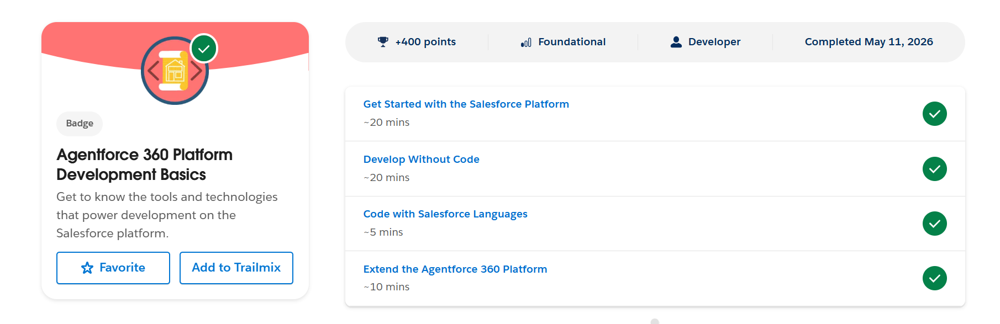

# Salesforce Fundamentals - Week 1, Day 3
## Platform Basics & Architecture

### 1. What is the Salesforce Platform?
The Salesforce Platform (formerly Force.com) is a cloud-based Platform as a Service (PaaS) that allows developers and administrators to build, customize, and deploy applications. It provides the underlying infrastructure, database, and security, allowing businesses to focus on creating solutions rather than managing servers.

### 2. Connect Day 1 + Day 2
**How CRM concepts fit into the Salesforce Platform:**
- CRM concepts like **Account**, **Contact**, and **Opportunity** are represented as standard **Objects** within the Salesforce database. 
- These objects are grouped together and presented to users through an **App** (such as the standard Sales App). 
- Essentially, the business concepts from CRM are mapped directly to technical building blocks (Objects and Apps) on the Salesforce Platform.

### 3. Platform Understanding
- **App**: In Salesforce, an App is a logical collection of items (like Tabs, Objects, Dashboards, and Reports) that work together to serve a specific business function or process (e.g., Sales App, Service App).
- **Object**: An Object is similar to a database table. It stores data specific to the organization. Salesforce provides **Standard Objects** (like Accounts and Contacts) and allows the creation of **Custom Objects** to store unique business data.
- **Tab**: A Tab is a user interface component that acts as a navigation link. It allows users to access a specific Object's records, a custom web page, or a dashboard within an App.

### 4. Configuration vs. Coding
Knowing when to use declarative tools (Clicks) versus programmatic tools (Code) is a critical skill in Salesforce.

**Configuration (No Code / Declarative):**
Use configuration when business requirements can be met using out-of-the-box features or point-and-click tools. It is faster to build, easier to maintain, and automatically upgraded by Salesforce.
*Examples:*
1. **Adding Fields**: Creating a new picklist field on the Account object to track "Customer Tier".
2. **Automation**: Using Salesforce Flow to automatically send a welcome email to a Contact when their record is created.

**Coding (Apex / LWC / Programmatic):**
Use coding when requirements are highly complex, require complex transactional logic, custom user interfaces, or integrations with external systems that cannot be achieved with declarative tools.
*Examples:*
1. **External Integration**: Writing Apex code to make a REST API callout to an external ERP system to fetch real-time inventory data.
2. **Complex Processing**: Creating a batch Apex class to process millions of records overnight, involving complex calculations and cross-object updates that exceed the limits of Salesforce Flow.

### 5. Real System Thinking: College Admission System
Building on the "College Admission System" from Day 1 & Day 2:

- **App Name**: University Admissions App
- **Objects Inside It**:
  - **High School (Account)**: The schools the students are applying from.
  - **Applicant (Contact)**: The individual prospective students.
  - **Application (Custom Object / Opportunity)**: Tracks the admission process stages (e.g., Submitted, Under Review, Waitlisted, Admitted, Rejected).
  - **Academic Program (Custom Object)**: The majors or degrees offered by the university.
- **How Users Interact With It**:
  - Admissions Officers log into the **University Admissions App** and use **Tabs** to navigate between Applicants and Applications.
  - They click on an **Applicant** record to see all related information, such as their high school and intended academic program.
  - They use List Views to quickly see all Applications currently "Under Review" and Dashboards to visualize the total number of admitted students per program.

### 6. Screenshots from Trailhead

