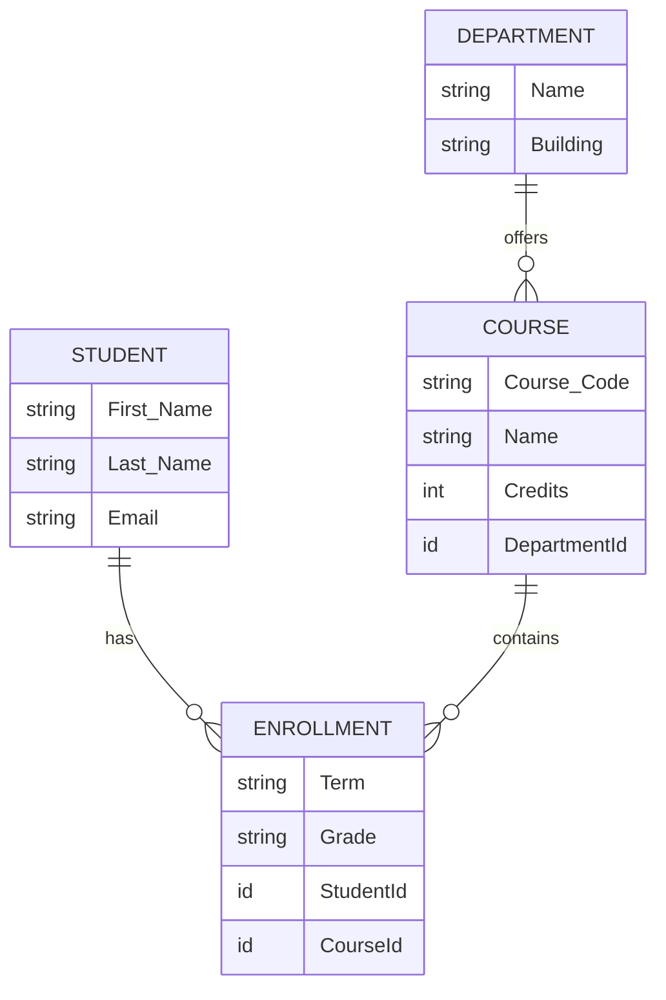

# Salesforce Fundamentals - Week 1, Day 4
## Data Modeling

### 1. Difference Between: App, Object, Record, and Field

To understand Salesforce architecture, it's helpful to compare it to a traditional spreadsheet or database:

*   **App**: A logical collection of components (like Objects, Tabs, and Dashboards) that work together to serve a specific business function. *(Think of an App as a dedicated workbook containing multiple related spreadsheets).*
*   **Object**: A database table that stores a specific kind of information. *(Think of an Object as a single tab/sheet within a spreadsheet workbook).*
*   **Record**: A single instance of data within an object. *(Think of a Record as a single row in your spreadsheet).*
*   **Field**: A place where you store a specific piece of information for a record. *(Think of a Field as a column in your spreadsheet).*

### 2. Standard vs. Custom Objects

*   **Standard Objects**: These are pre-built objects provided out-of-the-box by Salesforce. They are designed to handle standard business scenarios, primarily in sales and service. 
    *   *Examples:* Account, Contact, Opportunity, Lead, Case.
*   **Custom Objects**: These are objects created by a Salesforce Administrator to store data that is unique to the organization's specific business processes.
    *   *Examples:* Student, Course, Application, Invoice.

### 3. Your College Data Model

This data model represents a simplified University or College system tracking students, departments, and course enrollments.

#### Objects
1.  **Department** (Custom Object): Stores information about academic departments (e.g., Computer Science, Mathematics).
2.  **Course** (Custom Object): Stores details about the classes offered by a department.
3.  **Student** (Contact / Custom Object): Stores personal and academic information about enrolled students.
4.  **Enrollment** (Custom Object): A junction object used to track which students are enrolled in which courses.

#### Relationships
*   **Department to Course (1-to-Many):** A Department can offer many Courses, but a Course belongs to only one Department. *(Lookup or Master-Detail Relationship on Course)*.
*   **Student and Course (Many-to-Many):** A Student can take many Courses, and a Course can have many Students. This many-to-many relationship is resolved using the **Enrollment** junction object. The Enrollment object will have two Master-Detail relationships: one pointing to Student, and one pointing to Course.

#### Diagram

### 4. Formula Fields

**Explanation:** Formula fields are read-only fields that automatically calculate their value based on other fields, expressions, or functions. They update in real-time whenever the referenced fields change.

**Examples:**
1.  **Full Name (Student Object)**: Automatically concatenates the First Name and Last Name fields so users don't have to type it twice.
    *   *Formula:* `First_Name__c & " " & Last_Name__c`
2.  **Application Days Open (Application Object)**: Calculates how long an application has been open.
    *   *Formula:* `TODAY() - DATEVALUE(CreatedDate)`
3.  **Has Passing Grade (Enrollment Object)**: A checkbox formula that returns TRUE if the student's grade is above a certain threshold.
    *   *Formula:* `Grade_Percentage__c >= 60`

### 5. Validation Rules

**Explanation:** Validation rules verify that the data a user enters into a record meets specific standards before they can save it. If the condition evaluates to `True`, the rule triggers, prevents the save, and displays a custom error message.

**Examples:**
1.  **Valid Student Age (Student Object)**: Ensures that a prospective student is at least 16 years old.
    *   *Error Condition Formula:* `Age__c < 16`
    *   *Error Message:* "The student must be at least 16 years old to be registered in the system."
2.  **Course Credits Cannot Be Negative (Course Object)**: Prevents users from accidentally entering a negative number for course credits.
    *   *Error Condition Formula:* `Credits__c < 0`
    *   *Error Message:* "Course credits must be a positive value."
3.  **Missing Reason for Rejection (Application Object)**: If an application status is changed to "Rejected", a custom "Rejection Reason" text field must be filled out.
    *   *Error Condition Formula:* `ISPICKVAL(Status__c, "Rejected") && ISBLANK(Rejection_Reason__c)`
    *   *Error Message:* "Please provide a Rejection Reason when marking an application as Rejected."

### 6. Reflection: Why Structured Enterprise Data Matters

Structured enterprise data is the foundation of any successful organization. By defining a clear, logical data model (like using specific Objects and proper Relationships), we eliminate data redundancy and ensure data integrity. 

When data is structured properly in a system like Salesforce:
*   **Accuracy & Consistency:** Validation rules and standard fields prevent "bad data" from entering the system.
*   **Scalability:** A well-planned architecture can easily grow as the business adds new processes.
*   **Reporting & Analytics:** It becomes effortless to generate dashboards and reports (e.g., "How many students are enrolled in Computer Science this term?") because the database is organized relationally.
*   **User Experience:** Users can easily find, trust, and act upon the information they need without wading through messy, unorganized spreadsheets.
