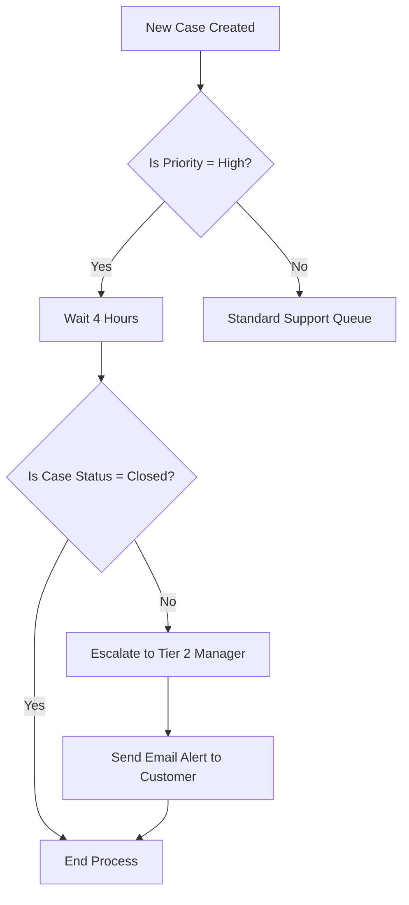

# Salesforce Fundamentals - Week 1, Day 5
## Automation in Salesforce: Flow Builder

### 1. What is Flow Builder?

Flow Builder is the primary, point-and-click declarative automation tool in Salesforce. It provides a visual interface for building complex business logic without writing any code. With Flow Builder, administrators can automate tasks, update records, send emails, make external system calls, and guide users through interactive screens. It is the modern replacement for older automation tools like Workflow Rules and Process Builder.

### 2. Types of Flows

*   **Screen Flow:** A flow that requires human interaction. It allows you to build an interactive UI (screens with forms, text, and inputs) that guides a user through a step-by-step business process. 
    *   *Example:* A wizard for customer support agents to collect specific information during a call and automatically create a related case and contact.
*   **Record-Triggered Flow:** A flow that runs automatically in the background when a record is created, updated, or deleted. It requires no human interaction to start.
    *   *Example:* When an Opportunity is marked as "Closed Won", a Record-Triggered Flow automatically creates an onboarding Task for the customer success team and sends a welcome email to the client.

### 3. Your Automation Ideas (5 Examples)

1.  **New Employee Onboarding:** Automatically create an IT ticket, send a welcome email, and assign training tasks when a new User record is created.
2.  **High-Value Deal Alert:** Automatically send a Slack notification or email to the executive team when an Opportunity is created with an amount greater than $100,000.
3.  **Case Auto-Response:** Automatically send a confirmation email with a Case Number to a customer immediately after they submit a support request.
4.  **Inactive Account Flagging:** Automatically change an Account's status to "At Risk" and create a follow-up task for the Account Owner if there has been no logged activity for 90 days.
5.  **Address Synchronization:** Automatically update the Mailing Address on all related Contact records whenever the Billing Address on their parent Account is changed.

### 4. Your Flow Diagram

This diagram represents an automated **Case Escalation Flow**. When a high-priority customer support case remains unresolved for more than 4 hours, it is automatically escalated to a Tier 2 Support Manager, and the customer is notified.

### 5. Manual vs Automated Process

| Feature | Manual Process | Automated Process |
| :--- | :--- | :--- |
| **Speed & Efficiency** | Slow, prone to bottlenecks as it relies on human action. | Instantaneous and runs in the background continuously. |
| **Error Rate** | High risk of human error (e.g., forgetting to send an email or update a field). | Zero risk of human error once configured correctly. |
| **Scalability** | Difficult to scale. More volume requires hiring more staff. | Highly scalable. Can handle 10 or 10,000 records effortlessly. |
| **Cost** | High operational costs due to time spent on repetitive tasks. | Lower operational costs by freeing employees to do higher-value work. |
| **Consistency** | Inconsistent. Different employees might follow the process differently. | 100% consistent. Follows the exact predefined business logic every time. |

### 6. Reflection: Why automation matters in enterprise system

Automation is a critical pillar of modern enterprise systems like Salesforce because it transforms how businesses operate at scale. 

*   **Empowering Employees:** By automating repetitive, mundane tasks (like sending standard follow-up emails, updating record statuses, or routing approvals), employees are freed up to focus on strategic, revenue-generating activities and complex problem-solving.
*   **Ensuring Compliance & Standardization:** In large enterprises, ensuring that every employee follows the exact same procedure is nearly impossible manually. Automation enforces business rules automatically, ensuring compliance with company policies and industry regulations.
*   **Enhancing Customer Experience:** Automation guarantees that customers receive timely responses. Whether it's an immediate confirmation email after submitting a case or a fast-tracked approval for a discount, automation eliminates the delays associated with manual processing, directly improving customer satisfaction.
