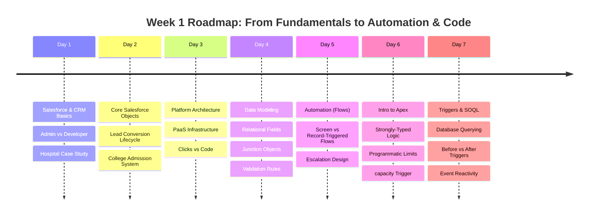

# Week 1 Summary: Salesforce Fundamentals & Core Platform Architecture

Welcome to the comprehensive summary of **Week 1** in the Salesforce Training Program. This week was dedicated to establishing a rock-solid foundation in customer relationship management (CRM) concepts, Salesforce architecture, data modeling, automated workflows, and server-side programmatic logic.

Below is an structured digest of the daily topics, architectural designs, and real-world system modeling completed during the first seven days of the program.

---

## 📅 Day-by-Day Learning Log



### 🔹 [Day 1: Salesforce Fundamentals](file:///c:/Users/kundu/OneDrive/Desktop/salesforce-training/WEEK-1/DAY-1/README.md)
*   **Core Focus**: Demystifying Salesforce as a cloud-based CRM and clarifying the responsibilities of platform practitioners.
*   **Key Concepts**:
    *   **CRM (Customer Relationship Management)**: Software systems designed to manage all interactions with leads, prospects, and customers in a unified portal.
    *   **Salesforce Admin vs. Developer**: Mapped the division of labor. Admins customize the system using declarative, point-and-click tools (users, reports, page layouts), while Developers build customized programmatic features using Apex, Lightning Web Components (LWC), and API integrations.
    *   **Hospital Management System**: Outlined a real-world cloud application to manage patient records, physician scheduling, billing, and patient-staff communication on one platform.

### 🔹 [Day 2: CRM Basics](file:///c:/Users/kundu/OneDrive/Desktop/salesforce-training/WEEK-1/DAY-2/README.md)
*   **Core Focus**: Deep dive into core CRM objects and standard sales processes.
*   **Key Concepts**:
    *   **Standard CRM Objects**:
        *   **Lead**: Potential customer/inquiry.
        *   **Account**: Company or client organization.
        *   **Contact**: Individual person working at an Account.
        *   **Opportunity**: A potential revenue-generating deal in progress.
    *   **Lead Conversion Process**: The workflow of qualifying a Lead, which automatically converts it into a related Account, Contact, and Opportunity record.
    *   **College Admission System Mapping**: Conceptualized a student recruitment pipeline (Prospective Student $\rightarrow$ Lead; High School $\rightarrow$ Account; Student Profile $\rightarrow$ Contact; Admission Application $\rightarrow$ Opportunity).

### 🔹 [Day 3: Platform Basics & Architecture](file:///c:/Users/kundu/OneDrive/Desktop/salesforce-training/WEEK-1/DAY-3/README.md)
*   **Core Focus**: Understanding the Platform-as-a-Service (PaaS) framework and navigating declarative customization.
*   **Key Concepts**:
    *   **Salesforce PaaS Structure**: Outlined how Salesforce hosts the underlying database, server infrastructure, and security controls, freeing organizations to focus on application logic.
    *   **UI Components**: Defined the structural relationship between **Apps** (logical collections of tabs), **Tabs** (navigation shortcuts to objects/pages), and **Objects** (data tables).
    *   **Configuration vs. Coding (Clicks vs. Code)**: Established the industry best practice of using configuration (low cost, fast delivery, automatic platform upgrades) as a priority, resorting to custom code (Apex, REST integrations, batch processing) only for highly complex requirements.

### 🔹 [Day 4: Data Modeling](file:///c:/Users/kundu/OneDrive/Desktop/salesforce-training/WEEK-1/DAY-4/README.md)
*   **Core Focus**: Database design, object relationships, data integrity, and custom field logic.
*   **Key Concepts**:
    *   **Data Hierarchy**: Compared spreadsheet terms to relational database terms (Workbook $\rightarrow$ App; Sheet $\rightarrow$ Object; Row $\rightarrow$ Record; Column $\rightarrow$ Field).
    *   **Relationships**:
        *   **One-to-Many**: Department to Course (a department offers many courses).
        *   **Many-to-Many**: Student to Course, resolved via an **Enrollment** junction object containing two master-detail relationships.
    *   **Formula Fields**: Read-only fields that calculate values in real-time (e.g., student full-name concatenation, days open).
    *   **Validation Rules**: Conditional formulas that evaluate data entry and block records from saving if they violate business logic (e.g., preventing negative course credits, enforcing minimum student age).

### 🔹 [Day 5: Automation in Salesforce](file:///c:/Users/kundu/OneDrive/Desktop/salesforce-training/WEEK-1/DAY-5/README.md)
*   **Core Focus**: Streamlining processes visually using the **Flow Builder** tool.
*   **Key Concepts**:
    *   **Screen Flows**: Guides users through a visual wizard with interactive inputs (e.g., case creation script).
    *   **Record-Triggered Flows**: Executes background tasks automatically when records are created, updated, or deleted (e.g., auto-escalating high-priority support cases, synchronizing customer addresses).
    *   **Manual vs. Automated Processes**: Evaluated the business impacts of automation: zeroing human error rates, achieving instant execution, maximizing team scaling, and enforcing policy compliance.

### 🔹 [Day 6: Introduction to Apex](file:///c:/Users/kundu/OneDrive/Desktop/salesforce-training/WEEK-1/DAY-6/README.md)
*   **Core Focus**: Server-side programmatic customization on the Salesforce Multitenant architecture.
*   **Key Concepts**:
    *   **Apex Programming**: Strongly typed, object-oriented language with Java-like syntax executing in a sandboxed runtime on Salesforce servers.
    *   **Governor Limits**: Shared cloud resource limits that make efficient code design (bulkification) essential.
    *   **Apex Use Cases**: Essential for complex REST/SOAP external ERP integrations, large-volume database processing (Batch Apex), and multi-object transactional rollback rules.
    *   **Junction Capacity Rule**: Designed Apex trigger pseudocode to check course enrollment capacity and block sign-ups if a class is full.

### 🔹 [Day 7: Triggers & SOQL](file:///c:/Users/kundu/OneDrive/Desktop/salesforce-training/WEEK-1/DAY-7/README.md)
*   **Core Focus**: Querying data and responding automatically to transactional database updates.
*   **Key Concepts**:
    *   **SOQL (Salesforce Object Query Language)**: Used to search and retrieve records from the database using SQL-like keywords optimized for object relationships.
    *   **Apex Triggers**: Event-driven blocks of code triggered by database events (`before insert`, `after update`, `before delete`, etc.).
    *   **Trigger Execution Timing**:
        *   *Before Triggers*: Used to validate inputs or modify values on the active records before they are saved to the database.
        *   *After Triggers*: Used to perform secondary actions on related objects (e.g., creating tasks, calling APIs) using the generated record ID.
    *   **Enterprise Reactivity**: Reflection on how automation guarantees data integrity and consistency across multiple interconnected systems.

---

## 🛠️ Unified Architectural Mapping: College Management System

Throughout the week, we mapped these concepts to a unified, scalable **College Management System**. This case study shows how each layer of Salesforce is utilized:

```
┌────────────────────────────────────────────────────────┐
│             University Admissions Custom App           │
│  (Aggregates tabs for Departments, Courses, Students)  │
└───────────────────────────┬────────────────────────────┘
                            │ (UI / Navigation Layer)
┌───────────────────────────▼────────────────────────────┐
│                    Data Schema Layer                   │
│   ┌──────────────┐   ┌────────────┐   ┌────────────┐   │
│   │  Department  ├───►   Course   │   │  Student   │   │
│   └──────────────┘   └─────┬──────┘   └─────┬──────┘   │
│                            │ (M-D)          │ (M-D)    │
│                      ┌─────▼────────────────▼─────┐    │
│                      │     Enrollment (Junction)  │    │
│                      └────────────────────────────┘    │
└───────────────────────────┬────────────────────────────┘
                            │ (Rules / Guardrails)
┌───────────────────────────▼────────────────────────────┐
│                  Declarative Guardrails                │
│    - Validation: "Age must be >= 16"                   │
│    - Formula: Full Name = FirstName + LastName         │
└───────────────────────────┬────────────────────────────┘
                            │ (Process Automation)
┌───────────────────────────▼────────────────────────────┐
│                   Declarative Automation               │
│   [Flow: If student credits >= 120, set Graduating]    │
└───────────────────────────┬────────────────────────────┘
                            │ (Programmatic Extension)
┌───────────────────────────▼────────────────────────────┐
│                     Programmatic Apex                  │
│  - Trigger: Capacity check ("Prevent over-enrollment") │
│  - Apex Integration: Call tuition payment gateway API  │
└────────────────────────────────────────────────────────┘
```

---

## 🎯 Major Achievements & Focus

1.  **Relational Database Design**: Mastered standard and custom object schema construction, including junction objects for many-to-many structures.
2.  **clicks-not-code Mindset**: Formulated a clear decision matrix for when to use drag-and-drop Flow Builder vs writing custom Apex code.
3.  **High-Level System Thinking**: Built an end-to-end conceptual design for a complex student registration database, incorporating UI design, data constraints, standard automation, and programmatic validation.
4.  **Awareness of Cloud Constraints**: Understood multitenancy and the necessity of Apex governor limits in protecting shared cloud infrastructure.
