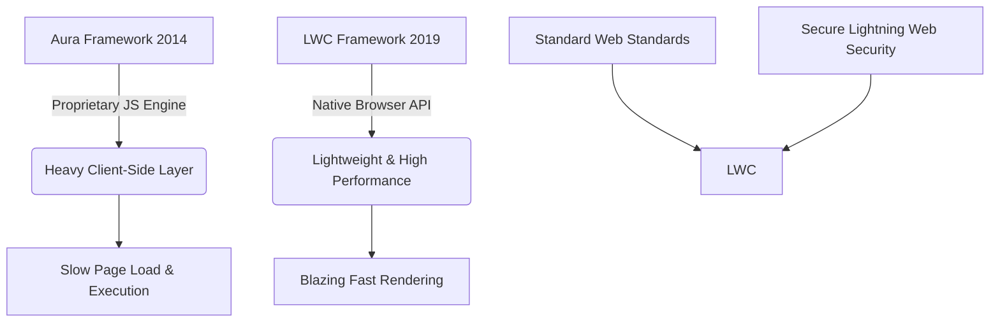

# 📅 Week 2, Day 1 (Day 8): Lightning Web Components (LWC) Basics & Secure Development

Welcome to **Day 8** of the Salesforce Summer Program! Today marks the transition from backend database models and server-side Apex logic to crafting modern, highly-responsive frontend user interfaces using **Lightning Web Components (LWC)**, alongside learning principles of secure server-side development.

---

## 🎯 Goal for Today
By the end of today, you should understand:
*   What **Lightning Web Components (LWC)** are and their core architecture.
*   Why modern enterprise platforms use **component-based UI architecture**.
*   The conceptual difference between **Frontend vs. Backend thinking**.
*   How to design a **reusable UI architecture** using the College Management System.
*   The principles of **Secure Server-Side Development**.

---

## 📚 Study Modules

### 1️⃣ Deep Learning Modules (IMPORTANT)
*   **Lightning Web Components Basics**
    *   *Focus*: LWC framework architecture, component directory structure, HTML templates, ES6+ JavaScript controllers, XML configuration metadata, and reusable designs.
*   **Lightning Web Components for Aura Developers (Overview)**
    *   *Focus*: Understanding the transition from legacy Aura frameworks to modern standard-compliant LWCs, highlighting native web standard benefits and performance gains.
    *   *Note*: A high-level understanding of this comparison is sufficient.

### 2️⃣ Light Completion Modules
*   **Secure Server-Side Development**
    *   *Focus*: Why platform security is vital, basic access control configurations, and writing safe Apex code (preventing injection, enforcement of Object and Field Level Security).
*   **Search Solution Basics** *(Optional / Pending)*

---

## 🎥 Video Resources (Verified Links)

*   [🎥 LWC Introduction for Beginners](https://www.youtube.com/watch?v=IHezETiVWPo)
    *   *Focus*: Frame of reference for LWC, structural concepts, and modern Salesforce UI elements.
*   [🎥 Lightning Web Components Crash Course](https://www.youtube.com/watch?v=U5qqsetTiLw)
    *   *Focus*: Direct deep dive into HTML + JavaScript + Meta XML relationships, lifecycle hooks, and live examples.
*   [🎥 Salesforce Security Basics](https://www.youtube.com/watch?v=8g7v6N8q4mE)
    *   *Focus*: Profiles, permission sets, enterprise security models, and record-level access control.

---

## 📖 Theoretical Overview: What & Why of LWC

### 1. What is LWC?
**Lightning Web Components (LWC)** is Salesforce's modern, lightweight framework for building custom user interfaces on the Lightning Platform. 

*   **Native Web Standards**: LWC is built directly on native browser technologies (such as Custom Elements, Templates, Shadow DOM, ECMAScript 6+ modules, and standard Decorators).
*   **Minimalistic Wrapper**: Because modern browsers natively support these features, LWC acts as a very thin, high-performance layer of Salesforce-specific services (like data binding and security) on top of standard APIs.
*   **File Structure**: A standard LWC is a bundle containing:
    *   `componentName.html`: Defines the layout structure using `<template>` tags.
    *   `componentName.js`: Handles logic, reactive state, and events in ES6+ JavaScript.
    *   `componentName.js-meta.xml`: Specifies deployment configuration, target pages (e.g., RecordPage, AppBuilder), and schema exposure.
    *   `componentName.css` *(optional)*: Enforces component-level scoping rules using Shadow DOM styling rules.

### 2. Why Salesforce Uses LWC
Salesforce transitioned from the legacy **Aura Framework** (introduced in 2014) to **LWC** (introduced in 2019) for several critical business and architectural reasons:



1.  **Blazing Performance**: Aura relied on a heavy custom JavaScript engine to build component abstractions. LWC runs natively on the browser's engine, bypassing heavy framework layers to achieve rapid execution and lower load times.
2.  **Modern Developer Ecosystem**: LWC uses standard modern JavaScript. Developers with React, Vue, or Angular experience can immediately work in LWC without learning a complex proprietary framework.
3.  **Strict Security (Lightning Web Security)**: LWC implements strong isolation boundary controls. It prevents scripts in one component from accessing the DOM, cookies, or storage of other components or global objects, ensuring absolute data security in a shared multi-tenant cloud environment.
4.  **Advanced Interoperability**: LWC is highly modular and easily integrates with external libraries, standards-compliant APIs, and legacy Aura containers.

---

## 🏛️ UI Thinking Exercise: College Management System

To scale our **College Management System**, we transition from custom data models to visual screens. Here are the **5 core UI screens/components** required to run the university digitally:

| UI Screen Name | Target Persona | Primary Functionality | Key Interactive Elements |
| :--- | :--- | :--- | :--- |
| **1. Student Registration Portal** | Prospective Students | Enables self-service application submissions, profile creation, and major selection. | Multi-step form, transcript upload widget, progress timeline. |
| **2. Student Dashboard & Enrollment** | Active Students | Hub to view schedules, check grades, monitor attendance, and add/drop courses. | Radial attendance charts, searchable course catalog grid, personal calendar. |
| **3. Faculty Grade & Attendance Portal** | Professors / Instructors | Streamlines daily classroom administration, grade submission, and performance reporting. | Interactive attendance grid, bulk grade input spreadsheet interface, student alerts. |
| **4. Administration Finance Hub** | Finance Staff & Students | Manages tuition payments, payment plans, scholarships, and billing statements. | Relational fee calculation summary, payment gateway integration, invoice generator. |
| **5. Campus Notifications & Alerts Widget** | All Users | Delivers real-time campus alerts, schedule changes, and direct system warnings. | Dynamic slide-out notification drawer, priority-coded banners (Critical, Info). |

---

## 🧩 Component Thinking: Student Dashboard Breakdown

Choosing the **Student Dashboard & Enrollment** screen, we break it down into modular, reusable UI components:

```
┌────────────────────────────────────────────────────────────────────────┐
│                        [ studentDashboardHeader ]                      │
├──────────────────────────────────────┬─────────────────────────────────┤
│                                      │     [ alertsDrawer ]            │
│      [ studentProfileSummary ]       │                                 │
│                                      ├─────────────────────────────────┤
│                                      │     [ attendanceProgress ]      │
├──────────────────────────────────────┴─────────────────────────────────┤
│                        [ courseCatalogGrid ]                           │
│  ┌──────────────────────┐ ┌──────────────────────┐ ┌────────────────┐  │
│  │    [ courseCard ]    │ │    [ courseCard ]    │ │   courseCard   │  │
│  └──────────────────────┘ └──────────────────────┘ └────────────────┘  │
└────────────────────────────────────────────────────────────────────────┘
```

### Component Inventory & Responsibilities
*   **`studentDashboardHeader`**: Renders university branding, active term selectors, and active user profile details.
*   **`studentProfileSummary`**: Renders student photo, ID number, primary major, advisor name, and dynamic GPA display card.
*   **`alertsDrawer`**: A slide-out panel listening for real-time messages (e.g., class location shifts, overdue library books, tuition deadlines).
*   **`attendanceProgress`**: A radial gauge displaying overall attendance percentages with color-coded warnings if attendance drops below 75%.
*   **`courseCatalogGrid`**: Serves as a parent container with search and filter inputs (by department or day) to view available electives.
*   **`courseCard`**: A highly reusable individual card displaying course name, credits, remaining seats, and a reactive "Enroll" button.

### 💡 Why Reusable Components are Vital in Enterprise Software
1.  **Maintainability**: If the layout of the course details needs an update, editing the `courseCard` component automatically propagates that change across the Student Portal, Faculty Course Portal, and Registrar view.
2.  **UX & Design Consistency**: Guarantees that interactive elements (buttons, inputs, status indicators) behave identically across the system, adhering to standard university branding and accessibility standards.
3.  **Rapid Development**: Once basic components (like buttons, search inputs, or cards) are coded, assembling new screens becomes a simple drag-and-drop process.
4.  **Parallel Workflows**: Frontend teams can work on different components simultaneously (e.g., one building the gauge, another the search grid) without blocking each other.

---

## 🔄 Frontend vs. Backend Thinking

Enterprise architecture requires a strict **Separation of Concerns (SoC)**. Frontend code runs client-side in the user's browser, while backend code executes server-side in the secure Salesforce multi-tenant cloud.

```
┌──────────────────────────────────────┐          ┌──────────────────────────────────────┐
│        Frontend: UI & UX             │          │       Backend: Security & Data       │
│      (Client's Web Browser)          │          │        (Salesforce Cloud)            │
│                                      │          │                                      │
│ - User interaction & click events    ├─────────►│ - Executes database triggers         │
│ - Render toast notifications         │   Apex   │ - Validates prerequisite logic       │
│ - Instant field format validation    │   Call   │ - Multi-record transaction rollbacks │
│ - UI toggles (hide/show panels)      │◄─────────┤ - Secure payment calculations        │
└──────────────────────────────────────┘          └──────────────────────────────────────┘
```

Here is where core system actions should reside and why:

### 1. Button Click (Frontend / Javascript)
*   **Action**: Capturing user interaction, opening modals, showing spinner indicators, toggling visibility.
*   **Why**: Handled entirely on the client side for instantaneous responsiveness. Routing button clicks to the server would create unnecessary latency and waste server computing cycles.

### 2. Client-Side Data Validation (Frontend / Javascript)
*   **Action**: Checking that an email address contains an `@` symbol or validating that a mandatory text field is not empty before the form is sent.
*   **Why**: Provides immediate, helpful feedback to the user, saving round-trips to the server and reducing system load.

### 3. Server-Side Data Validation (Backend / Apex & Triggers)
*   **Action**: Ensuring a student is not allowed to enroll in a course if they haven't completed the necessary prerequisites or if the course capacity is already full.
*   **Why**: Critical security check. Client-side checks can be bypassed (e.g., by disabling JavaScript or using API calls directly). Database integrity must always be guarded by secure, server-side validation.

### 4. Tuition & Fee Calculation (Backend / Apex)
*   **Action**: Computing final registration costs by evaluating credits, international status, waivers, and scholarships.
*   **Why**: Prevents tampering. Financial calculations must be auditable and mathematically secure. Running calculations on the client side risks user manipulation before database entry.

### 5. Notification Display (Frontend / Javascript)
*   **Action**: Renders successful enrollment toast banners or displays critical errors.
*   **Why**: The backend decides *what* the result of an action is (e.g., Success or Error code), but the frontend determines *how* to visually render this outcome to provide a premium user experience.

---

## 🧠 Reflection: The Rise of Component-Based UI

> [!NOTE]
> Modern enterprise systems (like Salesforce, SAP, and AWS console) are massive, continuously evolving suites of business logic serving thousands of concurrent users across varying profiles. 

Component-based architecture is the industry standard for these platforms due to the following structural requirements:
*   **Scalability**: Avoids "monolithic UI files" where a single bug can crash the entire interface. Individual features can be updated, deployed, and tested independently.
*   **Granular Security Boundary (LWS)**: In a multi-tenant cloud application, secure scoping is critical. Component architectures allow systems to isolate JavaScript execution, blocking malicious or faulty code in one component from reading secure data in another.
*   **State Management & Performance**: Modern component frameworks track component states reactively. When data changes, only the specific affected component re-renders (using Virtual/Shadow DOM comparisons), preventing expensive full-page reloads and reducing network bandwidth consumption.
*   **Consistent Accessibility (WCAG)**: Packaging accessibility rules, keyboard navigation, and screen-reader tags inside base components guarantees that every form and table built automatically complies with international accessibility laws.

---

## ✍️ Revision Questions & Answers

### 1. What is a component?
A component is a modular, self-contained, and reusable building block of a user interface. It encapsulates its own structure (HTML), logic/behavior (JavaScript), style (CSS), and configuration settings (Metadata XML), allowing it to work independently or interact within a nested hierarchy.

### 2. Why are reusable components useful?
They minimize redundant code, accelerate development through drag-and-drop assemblies, maintain visual and functional consistency across the platform, and make future updates easy (you update the master component file once, and it reflects everywhere it is referenced).

### 3. What is the difference between frontend and backend?
*   **Frontend**: The client-side interface running in the user's web browser. It is responsible for layouts, styling, interactive event capturing, client-side input validations, and rendering pages.
*   **Backend**: The secure server-side infrastructure running on Salesforce cloud servers. It handles the database tables, executes business validation logic, runs automated workflows/triggers, handles integrations, and runs advanced computations safely.

### 4. Why did Salesforce move toward LWC?
Salesforce moved to LWC to align with modern web browser standards. Aura was developed in 2014 when browsers lacked built-in capabilities for modular components, forcing Salesforce to build a heavy, proprietary framework. By 2019, modern browsers natively supported these standards. LWC leverages these native browser engines to deliver blazing-fast execution speeds, standard web development paradigms, and stronger security scopes.

### 5. Why is UI important in enterprise systems?
Enterprise users spend many hours a day inside these platforms. A high-performance, intuitive UI reduces training costs, prevents data entry errors, increases task efficiency, boosts user satisfaction, and guarantees high adoption rates of the custom CRM solution.

### 6. Why should systems separate UI and business logic?
Separation of concerns ensures that changes to the user interface (such as a styling overhaul) do not interfere with core database transactions, and that backend improvements do not break screen layouts. It also prevents client-side tampering with business rules, since critical checks are executed securely on the server.

### 7. What security risks exist in enterprise applications?
Key enterprise risks include:
*   **Broken Access Control**: Unauthorized users viewing or editing restricted records.
*   **Cross-Site Scripting (XSS)**: Injecting malicious scripts into input fields that execute in another user's browser.
*   **SOQL/SQL Injection**: Inserting raw query parameters that alter database searches to bypass security.
*   **Data Leaks**: Exposing sensitive database keys or business calculations in frontend source code.

### 8. Why should developers think modularly?
Modular thinking breaks complex, monolithic systems into smaller, isolated, and readable components. This dramatically reduces technical debt, makes bugs easy to isolate and repair, supports team collaboration without code collision, and allows code to be easily tested.

---

## 🎓 End of Day Outcomes
You should now have a robust understanding of:
1.  **LWC Architecture**: Standardized web elements, JavaScript classes, and metadata XML files.
2.  **Modern Salesforce UI**: The transition to native browser engines for blazing-fast visual performance.
3.  **Component-Based Thinking**: Constructing complex web interfaces by composing small, isolated, reusable parts.
4.  **Frontend vs. Backend Separation**: Establishing strict boundaries between visual interactions (client-side) and transaction logic (server-side).
5.  **Platform Security**: Mitigating injection risks and enforcing database access boundaries.
