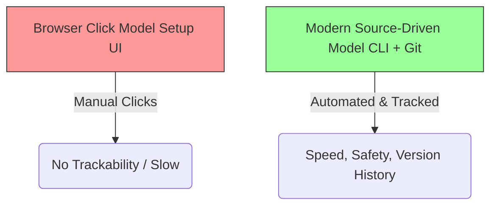

# 📅 Week 2, Day 5 (Day 12): Professional Salesforce Developer Workflow

Welcome to **Day 12** of the Salesforce Summer Program! Today, we transition from building standalone applications, user interfaces, automation, and backend logic to understanding how **professional engineering teams collaboratively build, test, and deploy enterprise systems**. 

In a real-world enterprise, code is never written directly in production, and development is never done solely through web browser clicks. Instead, developers use modern tooling like **Salesforce DX (SFDX)**, the **Salesforce CLI**, and **GitHub** version control to build scalable, source-driven systems.

---

## 🎯 Goal for Today
By the end of today, you should understand:
*   How real-world Salesforce engineering teams develop collaboratively.
*   The shift from **Org-Based** to **Source-Driven (Salesforce DX)** development.
*   Why the **Command-Line Interface (CLI)** is vital for developer productivity.
*   How **GitHub** integration prevents code collision and maintains platform integrity.
*   The risks of team collaboration without structured branches and deployment pipelines.
*   The difference between **College Coding** and **Enterprise-Grade Software Engineering**.

---

## 📚 Study Modules

### 1️⃣ Deep Learning Modules (IMPORTANT)
*   **Quick Start: Salesforce DX**
    *   *Focus*: Understanding source-driven development, project scratch orgs, syncing metadata between local environments and the cloud, package-based deployments, and version control integration.
*   **Command-Line Interface**
    *   *Focus*: Becoming productive in the terminal. Authenticating developer orgs, creating projects, retrieving and deploying components, and scripting automated commands using the Salesforce CLI.

### 2️⃣ Light Completion Modules
*   **Org Development Model**
    *   *Focus*: Managing changes in sandbox environments, understanding change sets, comparing sandbox-centric vs. source-centric thinking, and coordinating collaborative releases.
*   **Agentforce DX (Overview)**
    *   *Focus*: Introduction to modern AI-enabled developer tooling, automated code generation, smart terminal suggestions, and AI-assisted deployment pipelines (Exposure only).

---

## 🎥 Video Resources (Verified Links)

*   [🎥 Salesforce DX Introduction](https://www.youtube.com/watch?v=HV9fZei0-xs)
    *   *Focus*: Modern Salesforce workflow, core DX concepts, and source-driven development.
*   [🎥 Salesforce CLI Tutorial](https://www.youtube.com/watch?v=woINcxIT4ng)
    *   *Focus*: Command-line terminal workflow, key commands, and developer productivity tips.
*   [🎥 GitHub + Salesforce Workflow](https://www.youtube.com/watch?v=5xW0j9p8R90)
    *   *Focus*: Setting up version control, branching strategies, collaborative team workflows, and continuous integration.

---

## ⚙️ Core Task 1: Developer Workflow Thinking

Professional software development requires speed, repeatability, and safety. Relying solely on the browser (Setup menu UI clicks) is unacceptable for large enterprise applications.



### Why Professionals Use GitHub, CLI, and DX:

1.  **GitHub (Version Control)**:
    *   **Single Source of Truth**: Under the old model, the Salesforce Org itself was the source of truth. With DX and GitHub, the **Git repository is the source of truth**. Every change is tracked, versioned, and auditable.
    *   **Peer Review & QA**: Changes cannot bypass review. Developers create Pull Requests (PRs), allowing other engineers to review, comment on, and approve code before it is integrated.
    *   **Time Travel & Rollbacks**: If a bug is deployed, Git allows the team to pinpoint exactly who made the change, when, and immediately revert the repository to a stable historic state.

2.  **Salesforce CLI (Command Line Interface)**:
    *   **Speed & Automation**: Developers can execute tasks in milliseconds—like creating a component, running tests, or deploying changes—which would take minutes of tedious clicks in the browser.
    *   **Continuous Integration (CI/CD)**: Human beings make mistakes. Terminal commands can be automated in scripts. By using the CLI, build tools (like GitHub Actions) can automatically test and deploy code whenever a developer pushes changes, ensuring no broken code reaches production.
    *   **Local IDE Integration**: Seamless integration with tools like VS Code allows developers to write Apex, LWC, and XML config in a local, custom-themed environment with advanced linting and auto-complete features.

3.  **Salesforce DX (Developer Experience)**:
    *   **Source-Driven Format**: Traditional metadata was bundled in monolithic files. DX breaks down complex metadata (like custom objects or profiles) into small, readable, local JSON and XML files that are easily tracked in Git.
    *   **Scratch Orgs**: Developers can spin up empty, disposable, fully customized Salesforce environments in seconds to build and test features in isolation, preventing developers from overriding each other's changes.

---

## 👥 Core Task 2: Team Collaboration Thinking

Imagine a team of **10 developers** working simultaneously on the same Salesforce project without modern workflows. Let's analyze the problems they would face:

```
                  [ MONOLITHIC SANDBOX ]
                  (Without Version Control)
                             │
     ┌───────────────────────┼───────────────────────┐
     ▼                       ▼                       ▼
Developer A             Developer B             Developer C
(Writes trigger)       (Overwrites code)       (Deletes field)
     │                       │                       │
     └───────────────────────┼───────────────────────┘
                             ▼
              [ SYSTEM CRASH / LOSS OF DATA ]
```

### The Pitfalls of Legacy Collaboration:

*   **Code Overwriting (The Last-Write-Wins Disaster)**:
    *   *Scenario*: Developer A edits a helper class in the sandbox to add feature X. Five minutes later, Developer B edits the exact same class to add feature Y, unaware of Developer A's changes.
    *   *Result*: Developer B saves their code, completely overwriting Developer A’s edits. Feature X vanishes from the system, causing sudden, mysterious bugs in testing.
*   **Env/Metadata Pollution**:
    *   *Scenario*: Multiple developers build features in one shared sandbox. One developer creates experimental fields, another writes incomplete validation rules, and a third creates draft flows.
    *   *Result*: The sandbox becomes unstable and polluted. It becomes nearly impossible to isolate one clean feature to deploy to production because everything is tangled together in a single org.
*   **The Deployment Blindspot**:
    *   *Scenario*: Without version control, deployments are done using manual Change Sets. A developer has to remember all 50 custom fields, pages, layouts, and components they touched.
    *   *Result*: Deployments routinely fail because dependent components are forgotten, leading to hours of troubleshooting in production during midnight releases.

### How Git Branches & Deployment Workflows Solve This:

```mermaid
gitGraph
    commit id: "Initial Production State"
    branch dev-featureA
    checkout dev-featureA
    commit id: "Dev A: Add course capacity check"
    commit id: "Dev A: Write unit tests"
    checkout main
    branch dev-featureB
    checkout dev-featureB
    commit id: "Dev B: Build tuition calculator LWC"
    checkout main
    merge dev-featureA id: "PR Approved & Deployed"
    merge dev-featureB id: "PR Approved & Deployed"
```

1.  **Isolated Branches**: Each developer works in their own branch (e.g., `feature/tuition-calculator`). They write and test their code in separate Scratch Orgs or Developer sandboxes.
2.  **Pull Requests & Conflict Resolution**: Before merging, GitHub automatically compares the branch against the `main` branch. If there are conflicts (e.g., two developers edited the same file), Git highlights them and forces a manual resolution *before* code is merged.
3.  **Automated Quality Gates**: Pushing code to GitHub triggers automated tests. If code coverage drops below 75% or if a test fails, the merge is blocked automatically, keeping the stable branch protected.

---

## ⚙️ Core Task 3: Real Engineering Thinking

There is a massive cognitive gap between writing code for a college assignment and building enterprise software for a multi-million dollar corporation.

| Dimension | College Coding Assignments | Enterprise Software Development |
| :--- | :--- | :--- |
| **Testing** | Often skipped entirely or done manually. If it compiles and runs once, it's considered "done". | **Mandatory & Automated**. Code must pass strict unit test coverage, integration tests, and regression suits. Code cannot merge without proof of safety. |
| **Collaboration** | Single-developer focus or simple group work. Code is shared via email or single-branch repositories. | **Scale of 10–100s of Engineers**. Strict branching strategies (GitFlow), peer code reviews, and structured coordination across different global time zones. |
| **Deployment** | Drag-and-drop or run locally. Code is uploaded once, graded, and then archived. | **Automated Pipelines (CI/CD)**. Staged deployments through multiple environments (Scratch Org $\rightarrow$ Dev Sandbox $\rightarrow$ QA $\rightarrow$ UAT $\rightarrow$ Staging $\rightarrow$ Production). |
| **Rollback Capability** | If something breaks, edit the file locally, hit save, or start over. No history tracked. | **Critical Core Feature**. The ability to revert any bad deployment in minutes using git commands and automated backup scripts to prevent business downtime. |
| **Reliability & Scale** | Runs on a local computer with a mock database of 10 rows. Scalability and performance are ignored. | **High Performance & Multi-Tenancy**. Code must handle millions of records, respect strict shared server limits (Governor Limits), and support thousands of concurrent users. |
| **Auditing & Compliance**| No auditing. Code sharing is private. | **Strictly Audited**. Financial systems, data privacy compliance (GDPR/HIPAA), and detailed change logs of who touched what data, when, and why. |

---

## 🧠 Core Task 4: Reflection Task

> [!NOTE]
> *Learning the professional Salesforce development workflow shifts your perspective from being a "coder" to becoming a **"software engineer"**.*

### Key Realizations About Professional Software Engineering:
1.  **Writing Code is Only 20% of the Job**: Real engineering is about system stability, maintainability, and collaboration. Creating complex logic is useless if it cannot be safely merged, tested, audited, and deployed by a global team.
2.  **Infrastructure-as-Code is Essential**: Managing environment configuration as metadata files (stored in Git) is far superior to configuring systems manually. It makes environments reproducible and deployments predictable.
3.  **Embracing Disposability (The Scratch Org Mindset)**: Moving away from pet orgs to disposable scratch orgs reduces technical debt and forces developers to write highly modular, self-contained packages.

---

## ✍️ Revision Questions & Answers

### 1. Why do enterprise teams use version control?
Enterprise teams use version control (like Git) to maintain a single source of truth, track historical changes, prevent developers from overwriting each other's code, facilitate collaborative peer reviews via Pull Requests, and enable fast rollbacks during system failures.

### 2. Why is deployment workflow important?
A deployment workflow ensures that updates are thoroughly tested in isolated environments (QA, UAT, Staging) before reaching Production. This mitigates system downtime, guards database integrity, and ensures release quality.

### 3. What problems happen without collaboration tools?
Without collaboration tools, teams suffer from constant code overwrites ("last-write-wins"), polluted environments with stray metadata, merge conflicts that stall releases, broken feature regressions, and lack of accountability for system bugs.

### 4. Why is Salesforce DX important?
Salesforce DX (Developer Experience) shifts development from org-centric to source-centric. It enables the use of modern developer tools, modular metadata packaging, scratch org creation on-demand, and seamless integration with standard CI/CD pipelines.

### 5. Why do developers prefer CLI tools?
CLI tools allow developers to execute complex workflows (such as authorization, test runs, retrieval, and deployment) in milliseconds using simple commands. It also enables the scripting and automation of repetitive tasks in build pipelines.

### 6. Why do enterprise systems require rollback capability?
In production systems, even a minor bug can result in thousands of dollars of lost revenue or data corruption per minute. A fast rollback capability allows developers to immediately revert a failed deployment to the last known stable state while they troubleshoot the issue offline.

### 7. Why should teams separate development and production?
Separating environments prevents untested changes from impacting active business operations. It protects sensitive production data from developer access and allows teams to safely run heavy tests and stress simulations in isolated sandboxes.

### 8. Why is source-driven development useful?
Source-driven development defines the Git repository as the ultimate source of truth instead of a live sandbox org. It makes deployments repeatable, trackable, and modular, allowing teams to build package-based applications that are easy to maintain.

### 9. Why is collaboration difficult in large projects?
Large projects feature highly interdependent metadata layers, where multiple developers are changing overlapping files simultaneously. Without rigorous coordination, version control, and regression testing, this overlap leads to merge collisions and system regressions.

### 10. Why is engineering workflow important?
An engineering workflow replaces chaos with predictable, automated processes. It guarantees that code is linted, peer-reviewed, tested, and systematically deployed, shifting the team's focus from firefighting system crashes to delivering business value.

---

## 🎓 End of Day Outcome
You should now clearly understand:
*   **Collaborative Salesforce Workflows**: Moving away from isolated browser clicks to team-wide source-driven engineering.
*   **The Power of CLI & DX**: Harnessing terminal automation and scratch orgs to boost developer speed.
*   **GitHub Integrity**: Leveraging branching, pull requests, and merge strategies to protect enterprise repositories.
*   **Enterprise Reliability Mindset**: Respecting the rigorous testing, deployment gates, and rollback policies required to manage real-world enterprise software.
