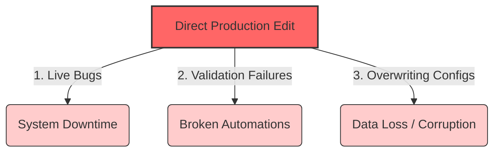

# 📅 Week 2, Day 6 (Day 13): Salesforce DevOps & CI/CD Pipelines

Welcome to **Day 13** of the Salesforce Summer Program! Today, we take the ultimate step in professional software delivery: transitioning from "learning Salesforce" to **"understanding professional software delivery."** We focus on how enterprise Salesforce systems are safely deployed, validated, and maintained by cross-functional engineering teams using **DevOps** principles and **Continuous Integration/Continuous Deployment (CI/CD)** pipelines.

---

## 🎯 Goal for Today
By the end of today, you should understand:
*   Why enterprise teams must implement structured **CI/CD pipelines**.
*   The architecture of **GitHub Actions** workflows for automated testing and validation.
*   The dangers of directly modifying Salesforce production environments.
*   How to build **robust development lifecycles** with sandboxes, QA, and production boundaries.
*   How to handle system failures, rollbacks, and recovery in high-stake production systems.

---

## 📚 Study Modules

### 1️⃣ Deep Learning Modules (IMPORTANT)
*   **Org Development Model**
    *   *Focus*: Sandboxing strategy, development and release lifecycle, team coordination, change management, and automated metadata deployments.
*   **Salesforce DevOps / Deployment Workflow**
    *   *Focus*: Core CI/CD concepts, automated release pipelines, validating package deployments before production release, and automated testing frameworks.
    *   *Note*: Focus entirely on core workflows and conceptual design rather than syntax-level configuration files.

### 2️⃣ Light Completion Modules
*   **Agentforce DX (Overview)**
    *   *Focus*: AI-driven developer workflows, smart DevOps assistance, automated pipeline monitoring, and predictive deployment conflict checking.
*   **Visualforce & Aura Basics (if pending)**
    *   *Focus*: Reviewing legacy component deployments and understanding backward compatibility in DevOps (Exposure only).

---

## 🎥 Video Resources (Verified Links)

*   [🎥 Salesforce DX + Git + CI/CD Pipeline](https://www.youtube.com/watch?v=qegFqum-M9o)
    *   *Focus*: Setting up GitHub version control, building automated CI/CD pipelines, and executing package deployments.
*   [🎥 Salesforce DevOps Using GitHub Actions](https://www.youtube.com/watch?v=eybYM1Hw-9I)
    *   *Focus*: Customizing GitHub Actions runners, writing automated deployment scripts, and configuring environment secrets.
*   [🎥 CI Workflow with GitHub Actions](https://www.youtube.com/watch?v=ZU1bJkGIxkk)
    *   *Focus*: Executing automated test suites, generating code coverage metrics, and automating sandbox synchronization.

---

## ⚙️ Core Task 1: Deployment Pipeline Thinking

Imagine our **College Management System** is active, serving **50,000 students**, **500 faculty members**, and coordinated by **multiple system administrators**. 

### Why Direct Production Modifications Are Extremely Dangerous:



1.  **Immediate Downtime & Performance Bottlenecks**:
    *   *Risk*: Writing code or modifying a live Flow in Production bypasses the compiler checks. A syntax error, infinite loop in a trigger, or CPU-intensive query will immediately freeze active user sessions, locking out 50,000 students attempting to register for classes.
2.  **Silent Automation Failures**:
    *   *Risk*: Editing a validation rule or field directly in Production can silently break background processes. For example, modifying the student GPA field type can cause Apex triggers to crash silently during batch tuition runs, leaving invoices unpaid.
3.  **Catastrophic Data Loss**:
    *   *Risk*: Deleting a field or modifying a relationship (e.g., converting a master-detail to lookup) in a live production database instantly deletes all historic data values inside that field across all 50,000 students. This can result in irreparable financial and academic record loss.
4.  **Audit & Compliance Violations**:
    *   *Risk*: Direct edits leave no revision trail. If a financial automation is modified directly, there is no proof of who changed the logic, why they changed it, or if it was peer-approved, violating institutional auditing guidelines.

---

## 👥 Core Task 2: Team Collaboration Scenario

Suppose **10 developers** are building different features (e.g., grading dashboards, tuition calculators, scholarship approvals) on the same Salesforce project concurrently.

```
                   [ COLLABORATIVE CHAOS ]
                  (Without DevOps Controls)
                             │
     ┌───────────────────────┼───────────────────────┐
     ▼                       ▼                       ▼
Developer A             Developer B             Developer C
(Edits Object XML)     (Overwrites Profile)     (Deletes Class)
     │                       │                       │
     └───────────────────────┼───────────────────────┘
                             ▼
               [ CODE RECOVERS ARE IMPOSSIBLE ]
```

### The Chaos Without DevOps Controls:

*   **Version Control Absent**: Developers build directly inside a single sandbox. Developer A edits the student registration controller, and Developer B overwrites the same file two minutes later. Git history is absent, making it impossible to restore the overwritten feature.
*   **Branching Deficiencies**: Without isolated Git branches, Developer A's experimental, unfinished code is active in the same environment where Developer B is trying to validate their completed feature. Unfinished code breaks the testing suite, stalling the entire release cycle.
*   **Absence of Automation (No Pipelines)**: Deployments are done manually using change sets. Developers spend hours writing down list items of components to move. Important dependencies are missed, leading to broken releases and continuous pipeline failures.
*   **Lack of Automated Testing**: Code is deployed without validating unit tests. Hidden bugs in the grading module slip into production, corrupting GPA calculations for graduating students.

---

## 🚀 Core Task 3: CI/CD Thinking (End-to-End Pipeline)

A modern, high-performing software engineering team implements an automated deployment pipeline. Let's analyze the exact step-by-step CI/CD pipeline and trace why each gate is essential:

```
[ Developer Writes Code ] 
          │
          ▼
[ GitHub Commit / Push ]  ──► (Gate 1: Static Code Review & Linting)
          │
          ▼
[ Automated Testing ]     ──► (Gate 2: Run Apex Unit Tests & Assertion Validation)
          │
          ▼
[ Validation / Dry-Run ]  ──► (Gate 3: Validate Metadata Sync Against Production)
          │
          ▼
[ Automated Deployment ]  ──► (Gate 4: Automated DML & Metadata Deployment)
          │
          ▼
[ Production Release ]    ──► (Gate 5: Active Monitoring & Quick Revert)
```

### Deep Dive: Why Each Gate Matters
1.  **Developer Writes Code Locally**: The developer writes code inside a clean, isolated scratch org. This prevents environment pollution and ensures code is self-contained.
2.  **GitHub Commit & Push**: Pushing code to a feature branch registers the change in the history log, creating an auditable track record. A pull request is generated, initiating static analysis and manual peer code reviews.
3.  **Automated Testing**: The CI/CD engine (GitHub Actions) spins up an isolated sandbox environment, deploys the metadata, and runs all Apex unit tests. If code coverage is under 75% or any assertion fails, the build is rejected, protecting the code branch.
4.  **Validation (Dry Run)**: Before actual deployment, the pipeline runs a "deploy validation." This is a simulated, all-or-nothing dry run against the Production Org. It ensures that there are no active metadata conflicts, missing dependencies, or organization-level permission errors.
5.  **Deployment**: Once validated and approved, the pipeline executes the automated migration. The tool moves code, fields, layouts, and permission sets into the live production database in a single automated block.
6.  **Production Release**: The changes become live to users. The system runs automated smoke tests and security monitors to verify overall stability. If anomalies are detected, the system executes an automated rollback to restore the last stable state.

---

## 🧠 Core Task 4: Reflection

> [!NOTE]
> *Software engineering is distinct from simple programming. Anyone can write code that runs once on a local machine, but software engineering is about delivering reliable systems to thousands of users over time.*

### Writing Code vs. Engineering Enterprise Software:
*   **Writing Code** is a singular task focused on writing functional lines of instructions to solve a defined puzzle. It is personal, static, and carries low operational risk.
*   **Engineering Enterprise Software** is a team-based discipline focused on building, maintaining, and scaling secure systems. It requires building robust safety nets (automated tests), coordinating environments (CI/CD), enforcing strict quality boundaries (DevOps), and designing for disaster recovery (rollbacks) to protect active business operations.

---

## 📁 GitHub Submission
To submit your work, create the directory `/day13-devops-cicd/` in your repository. The `README.md` inside must include:
*   **What is CI/CD?**: Summarizing the automated processes of Continuous Integration (testing/validation) and Continuous Deployment (delivery).
*   **Why Deployment Workflow Matters**: Explaining how staged environments protect user experience and prevent server downtime.
*   **Problems Without Version Control**: Highlighting the risks of lost code, developer overwrite conflicts, and missing rollbacks.
*   **GitHub + DX + DevOps Explanation**: Detailing how Git (version control), DX (metadata source), and DevOps (automated pipeline runners) integrate together.
*   **Enterprise Deployment Risks**: Breaking down active transaction locking, integration failures, and data compliance leaks.
*   **Reflection**: Your personal insights on the difference between writing scripts and engineering production systems.

---

## ✍️ Revision Questions & Answers

### 1. Why is deployment workflow important?
A deployment workflow ensures all system updates are systematically coded, peer-reviewed, tested, and staged through isolated environments before reaching production. This prevents regressions, minimizes bugs, and secures database stability.

### 2. Why should teams avoid editing production directly?
Direct edits skip quality gates, compile checks, and unit assertions, risking immediate system downtime, performance issues, broken automations, compliance violations, and catastrophic data loss.

### 3. What problems happen without version control?
Without version control, teams suffer from code overwrites, lack of progress history, inability to track who modified what line of code, complex merge conflicts, and the absence of a reliable rollback mechanism.

### 4. Why do enterprise systems require CI/CD?
CI/CD automates manual build and deployment steps. It executes quality checks (linting, testing, validation) on every commit, ensuring bugs are identified immediately, deployment times are reduced, and delivery stays predictable.

### 5. Why should testing happen before deployment?
Pre-deployment testing ensures that new features do not break existing business rules (regressions), assertion blocks are valid, system performance meets quality standards, and code coverage complies with Salesforce's mandatory 75% boundary.

### 6. Why do large teams need branches?
Branches isolate developers' work environments. This enables multiple engineers to construct features in parallel without interfering with each other's code, preventing unfinished work from destabilizing the core repository.

### 7. What is rollback and why is it important?
A rollback is the process of restoring a database or application metadata to a previous stable state. It is crucial because it allows engineering teams to recover instantly from unexpected production crashes or deployment failures, protecting active business users.

### 8. Why are deployment pipelines useful?
Deployment pipelines replace manual, error-prone workflows with predictable, automated delivery tasks. They guarantee that every release goes through identical quality audits, reducing human deployment errors.

### 9. Why is DevOps important in modern software engineering?
DevOps bridges the gap between development and operations teams. It integrates collaboration, automation, security, and continuous feedback to accelerate software delivery while maintaining high system stability.

### 10. Why is enterprise software development different from simple coding?
Enterprise systems are multi-user, multi-tenant, scale-dependent, and heavily integrated. Development requires careful coordination, automated validation, strict security checks, performance considerations, and compliance auditing, which are absent in basic coding tasks.

---

## 🎓 End of Day Outcome
You should now clearly understand:
*   **The Enterprise Release Path**: How to coordinate sandboxes, QA, and staging boundaries.
*   **CI/CD Automation**: The mechanics of GitHub Actions and automated quality validation gates.
*   **DevOps Mindset**: Treating deployments as predictable, auditable, and reliable processes.
*   **Professional Reliability**: Securing active production databases using rigorous testing and rollback pipelines.
