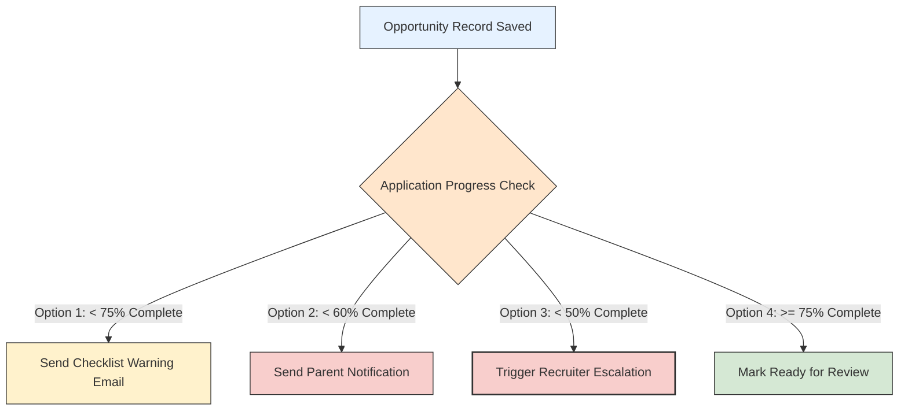

# 📅 Week 2, Day 7 (Day 14): Controlled Workflows & Enterprise Governance

Welcome to **Day 14** of the Salesforce Summer Program! Today, we transition our automation expertise from building **"simple automation"** to designing **"controlled enterprise workflows."** 

Using our chosen **College Admission System** schema, we will explore how large educational institutions govern their data. In an enterprise system, we cannot permit recruiters, admissions staff, or external school partners to modify sensitive records arbitrarily. Instead, we implement structured **Flow Builder Logic**, **Decision-Based Branching**, and **Multi-Level Approval Processes** to secure and audit the student conversion lifecycle.

---

## 🏛️ System Schema: College Admission
Our architectural data model is mapped to standard Salesforce CRM objects:
*   **Account**: Represents a **College or educational institution** partner.
*   **Contact**: Represents a **Student, parent, or staff member** associated with the college.
*   **Lead**: Represents a **Student inquiry or application** showing active interest in admission.
*   **Opportunity**: Represents the **Admission opportunity** (the chance of converting the interested student into a successfully enrolled student).

---

## 🎯 Goal for Today
By the end of today, you should understand:
*   How to build complex, branching business logic in **Flow Builder** for student recruitment.
*   The architecture and governance of **Salesforce Approval Processes** for institutions.
*   How to design automated **multi-level approval workflows** for admissions and scholarships.
*   How to handle complex decision-making and routing paths using variables.
*   Why enterprise systems must enforce **controlled workflows** over direct database manipulations.

---

## 📚 Modules To Complete

### 1️⃣ Flow Builder Logic
*   **Focus**: Decision elements, variable declaration and assignments, branching logical paths, complex formula evaluations, and multi-step background automations.

### 2️⃣ Approve Records with Approval Processes
*   **Focus**: Single and multi-step approval workflows, configuring entry criteria, assigning approval steps, managing lock-and-unlock mechanisms, defining approval/rejection actions, and maintaining compliance audit histories.

---

## 🎥 Videos (Properly Verified Working Links)

*   [🎥 Introduction to Salesforce Flow Builder | Day 1](https://www.youtube.com/watch?v=og6WyT2Ry-Y)
    *   *Focus*: Flow Builder interface, resource management, elements, and standard record triggers.
*   [🎥 Salesforce Flow Crash Course](https://www.youtube.com/watch?v=KVs_omNlaxg)
    *   *Focus*: Designing end-to-end automations, understanding screen elements, and tracing flow paths.
*   [🎥 Building Advanced Flows with Choices, Loops, and Apex](https://www.youtube.com/watch?v=Tr3GG-aLU4Q)
    *   *Focus*: Constructing collection loops, implementing choice elements, calling invocable Apex methods, and optimizing bulk limits.

---

## 🏛️ Core Task 1: Multi-Level Approval Design

To protect operational and financial integrity within our **College Admission System**, we design **four distinct multi-level approval workflows** mapping who approves, in what order, and what automated actions are triggered:

```
                          [ SUBMIT RECORD ]
                                  │
                                  ▼
                     [ Step 1: Initial Evaluator ]
                       (Approve / Reject Action)
                                  │
                     ┌────────────┴────────────┐
                     ▼ (If Approved)           ▼ (If Rejected)
         [ Step 2: Final Director ]    [ Rollback Changes ]
           (Approve / Reject Action)    [ Notify Submitter ]
```

### 1. College Partner Creation (Account Approval)
*   **Objective**: Ensure that new high schools or educational institutions added as partners are accredited and validated.
*   **Approval Order**:
    1.  **Step 1: Partner Relations Manager**: Verifies the institution's accreditation certificates, background details, and physical address.
    2.  **Step 2: Director of Global Partnerships**: Reviews the proposed partnership agreement, financial details, and strategic alignment.
*   **Post-Action Logic**:
    *   *Upon Approval*: The Account status changes to `Accredited Partner`, the record is unlocked, and an automated Flow triggers to notify local recruiters that they can start enrolling students from this institution.
    *   *Upon Rejection*: The Account status resets to `Draft/Rejected`, the record is unlocked, and a notification email is sent to the Partner Relations Manager to request updated certification documents.

### 2. Student Admission Application Submission (Lead Approval)
*   **Objective**: Guard the qualification gate of student inquiry applications before they are officially converted into active enrollments.
*   **Approval Order**:
    1.  **Step 1: Admissions Officer**: Audits the submitted transcripts, checks for mandatory fields (like GPA and standardized scores), and verifies English proficiency metrics.
    2.  **Step 2: Admissions Director**: Required only if the applicant's GPA is borderline (e.g., between $2.0$ and $2.5$) to evaluate special conditional admittances.
*   **Post-Action Logic**:
    *   *Upon Approval*: The Lead status updates to `Qualified`, the Lead is automatically converted into an Account (representing the student's billing details), a Contact (the student's profile), and an Opportunity (the active enrollment track).
    *   *Upon Rejection*: The Lead status is set to `Disqualified`, an automated rejection or waitlist notice is dispatched, and the record is locked to prevent further editing.

### 3. Student Scholarship & Fee Waiver (Opportunity Approval)
*   **Objective**: Control the release of institutional merit-based funding during active student enrollment conversion.
*   **Approval Order**:
    1.  **Step 1: Financial Aid Officer**: Validates the student’s financial aid application, verifies GPA, and checks matching scholarship eligibility rules.
    2.  **Step 2: VP of Student Finance**: Required to approve any scholarship allocation exceeding $50\%$ of tuition.
*   **Post-Action Logic**:
    *   *Upon Approval*: The Opportunity custom field `Scholarship_Approved__c` is checked, the billing ledger updates to reflect the discount, and an automated congratulatory email is sent to the student.
    *   *Upon Rejection*: The Opportunity status returns to `Standard Pricing`, the fee structure is locked, and a financial counseling appointment task is assigned to the recruiter.

### 4. High-Value Admissions Budget Allocation
*   **Objective**: Supervise massive marketing and recruitment budget expenditures across different territories.
*   **Approval Order**:
    1.  **Step 1: Territorial Recruitment Head**: Reviews the regional travel and marketing budget proposal.
    2.  **Step 2: Chief Financial Officer (CFO)**: Evaluates high-value budget requests exceeding $\$25,000$.
*   **Post-Action Logic**:
    *   *Upon Approval*: The budget status shifts to `Allocated`, purchase orders are auto-generated via integration to the external financial ledger, and the record is locked to prevent modification.
    *   *Upon Rejection*: The status resets to `Draft`, the budget is unlocked, and a revision alert is routed to the territorial manager.

---

## 👥 Core Task 2: Branching Flow Logic

To enforce strict quality checks during the student conversion pipeline, we design a automated **Record-Triggered Flow** on the **Opportunity** object that monitors application completeness and branches based on progress thresholds:



### Deep Dive: Branching Logic Execution
*   **Trigger Event**: A student or recruiter saves progress on the active enrollment Opportunity, updating the custom field `Application_Completeness_Percentage__c`.
*   **Decision Node (Progress Check)**:
    *   **Branch 1 (Warning Alert)**: Completeness is $< 75\%$ AND $\ge 60\%$.
        *   *Action Triggered*: The Flow fires an email to the student Contact containing a dynamic checklist of missing documents (e.g., recommendation letters or transcripts).
    *   **Branch 2 (Parental Notice)**: Completeness is $< 60\%$ AND $\ge 50\%$.
        *   *Action Triggered*: The Flow queries the related Parent Contact and dispatches an automated notification reminding them that the student's admission application is at risk of closure due to missing files.
    *   **Branch 3 (Crisis Escalation)**: Completeness is $< 50\%$.
        *   *Action Triggered*: The Flow sets the Opportunity stage to `Stalled`, automatically creates and assigns a high-priority task to the assigned Recruiter Contact ("Urgent Callout: Rescue Stalled Applicant"), and freezes automated pipeline transitions.

---

## ⚙️ Core Task 3: Governance Thinking

Enterprise software systems operate as the structural framework for a business. Permitting users or administrators to change records arbitrarily introduces immense operational and financial risk.

```
                  [ UNRESTRICTED SYSTEM ]
                (No Governance Controls)
                           │
      ┌────────────────────┴────────────────────┐
      ▼                                         ▼
 Malicious / Careless Change              Accidental Edit
- Delete high-value scholarship info    - Modify active grades
- Qualify unverified student Leads      - Disqualify active Opportunity
      │                                         │
      └────────────────────┬────────────────────┘
                           ▼
            [ BUSINESS FAILS / LEGAL LIABILITY ]
```

### Why a College Admission System Must Limit Database Modification Rights:

1.  **Security Boundaries & Data Privacy Prevention**:
    *   Without strict access governance, any user could view, edit, or extract sensitive student data. Financial records, academic performance transcripts, and social security data must remain heavily sandboxed to comply with regulations like FERPA and GDPR.
2.  **Mitigation of System Misuse and Fraud**:
    *   Without mandatory approval workflows, a compromised account or bad actor could allocate a $\$50,000$ scholarship to an unqualified candidate, convert unqualified student inquiries into enrollments, or write off tuition fees.
3.  **Preventing Broken Integrations and Process Inconsistencies**:
    *   Educational platforms connect to external databases (e.g., student payment networks). Unchecked edits bypass standard format validations. An invalid record value can crash external synchronization engines, halting invoice generation or admissions scheduling.
4.  **Operational Risk & System Reliability**:
    *   Ungoverned edits can lead to administrative chaos—like a recruiter accidentally deleting a student's history or an administrator deactivating a course syllabus in error, leading to class schedule conflicts and record disputes.

---

## 🧠 Core Task 4: Reflection

> [!NOTE]
> *Controlled workflows replace institutional chaos with predictable, auditable operations. They ensure that every action complies with academic rules and financial regulations.*

### Controlled Workflows vs. Unrestricted Action:
Unrestricted action is suitable for small personal projects where developers work in isolation. In enterprise architectures, **controlled workflows are non-negotiable**. They act as guardrails that prevent human error, maintain auditable records of decisions, secure databases from unauthorized modifications, and ensure that the software matches the institution's business logic.

---

## 📁 GitHub Submission
To submit your work, create the directory `/day14-flow-governance/` in your repository. The `README.md` inside must include:
*   **Approval Workflow Examples**: Detailing the 4 multi-level approvals (Account partner, Lead admission, Opportunity scholarship, and Budget allocations).
*   **Branching Flow Logic**: Documenting the Opportunity checklist completion trigger, including decision criteria, variables, and automated tasks.
*   **Governance Explanation**: Why colleges cannot permit unrestricted data modifications, drawing from FERPA compliance and fraud prevention.
*   **Reflection**: Your insights on the importance of controlled business logic in enterprise software development.

---

## ✍️ Revision Questions & Answers

### 1. Why are approval workflows important?
Approval workflows enforce operational controls by routing critical changes (like budget expansions or scholarship awards) to authorized stakeholders for review. This prevents unauthorized database modifications and maintains a strict audit history.

### 2. Why do businesses require governance?
Governance ensures that the system complies with legal regulations (GDPR, FERPA), protects sensitive data from unauthorized eyes, mitigates fraud, standardizes operations, and keeps system data consistent.

### 3. What are branching workflows?
Branching workflows are automated paths that use decision elements to route records through different actions based on specific data criteria (e.g., sending different alert levels based on varying student attendance ranges).

### 4. Why should automation follow business rules?
If automations bypass business rules, they can generate errors—like allocating duplicate student aid, scheduling professors to overlapping classes, or approving expenses that exceed corporate budgets.

### 5. Why are decision nodes important in flows?
Decision nodes act as logical intersections. They evaluate record criteria in real-time, allowing the Flow to branch and execute customized actions for different scenarios instead of running a single process.

### 6. Why should enterprises restrict sensitive operations?
Restricting sensitive operations (like altering grade records or releasing budget allocations) prevents data manipulation, avoids costly administrative errors, protects financial capital, and guarantees compliance with industry audits.

### 7. Why are approvals important in large organizations?
In massive organizations, manual verification is impossible. Standardized approval workflows automate routing, ensure that senior directors approve high-value transactions, reduce administrative bottlenecks, and prevent operational fraud.

### 8. Why should workflows be auditable?
Auditable workflows keep a clear, unalterable log of who initiated, reviewed, approved, or rejected a record change. This is essential for compliance audits, resolving billing disputes, and maintaining operational accountability.

---

## 🎓 End of Day Outcome
Students should now clearly understand:
*   **Approval Workflows**: Enforcing operational controls by routing critical updates to authorized reviewers.
*   **Branching Automation Logic**: Building complex decision logic based on progress and criteria metrics.
*   **Governance and Enterprise Control**: Restricting direct data edits to maintain integrity.
*   **Multi-step Business Processes**: Securing pipeline conversions across Leads, Accounts, and Opportunities.
*   **Structured Workflow Design**: Guaranteeing regulatory and compliance standards like FERPA.
