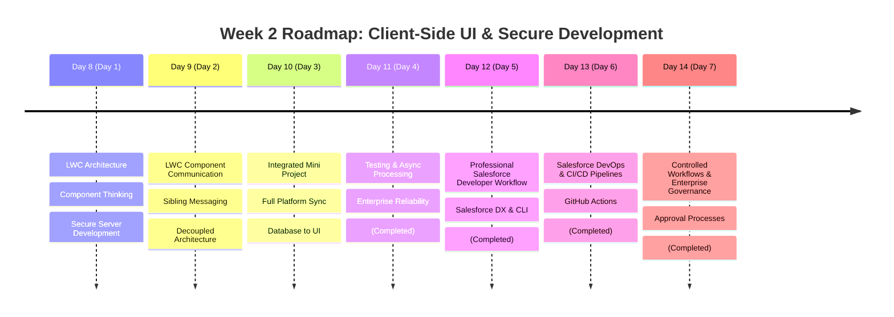

# Week 2 Summary: Lightning Web Components (LWC) & Modern UI Architecture

Welcome to **Week 2** of the Salesforce Training Program. This week is dedicated to transitioning from database design and server-side Apex code to crafting modern, reactive client-side user interfaces with **Lightning Web Components (LWC)** and building secure, production-ready Salesforce features.

Below is an architectural breakdown of the learning path, modules, and hands-on system designs completed during this phase of the program.

---

## 📅 Day-by-Day Learning Log

---

### 🔹 [Day 8 (Day 1): LWC Basics & Secure Development](file:///c:/Users/kundu/OneDrive/Desktop/salesforce-training/WEEK-2/DAY-1/README.md)
*   **Core Focus**: Transitioning from custom backend tables to visual web components and secure execution principles.
*   **Key Concepts**:
    *   **LWC Web Standards**: Leverage modern browser custom elements, HTML templates, ES6+ modules, and scoped CSS Shadow DOM instead of heavy client abstractions.
    *   **Component Thinking**: Dissecting monolithic screen flows into small, highly cohesive, reusable visual parts (e.g., `courseCard`, `alertsDrawer`) to maximize code reusability and visual consistency.
    *   **Frontend vs. Backend Boundaries**: Categorizing system behaviors into immediate client actions (button clicks, form rendering) and secure server operations (Apex fee calculation, validation triggers).
    *   **Secure Server-Side Development**: Exploring access control boundaries, field-level security enforcement, and safe coding standards to mitigate injection and privilege leaks.

---

### 🔹 [Day 9 (Day 2): LWC Component Communication & Modular UI](file:///c:/Users/kundu/OneDrive/Desktop/salesforce-training/WEEK-2/DAY-2/README.md)
*   **Core Focus**: Deep dive into event-driven UI behaviors, data flow execution, and component decoupling.
*   **Key Concepts**:
    *   **Component Communication**: Mastering parent-to-child `@api` data flows, child-to-parent custom events, and sibling communication via Lightning Message Service (LMS).
    *   **Dashboard Architecture**: Designing modular dashboard structures for Student, Faculty, and Admin personas with independent state controls.
    *   **End-to-End Data Flow**: Tracing the lifecycle of a user interaction (e.g. Attendance update) from client-side LWC triggers down to database events and notification flows.
    *   **Legacy vs. Modern UI**: Comparative study of server-rendered page postbacks (Visualforce) vs. heavy custom frameworks (Aura) vs. modern lightweight browser standards (LWC).

---

### 🔹 [Day 10 (Day 3): Integrated College Management Mini Project](file:///c:/Users/kundu/OneDrive/Desktop/salesforce-training/WEEK-2/DAY-3/README.md)
*   **Core Focus**: Connecting every layer of the Salesforce platform into a single, cohesive mini-project.
*   **Key Concepts**:
    *   **Relational Database Mapping**: Constructing custom objects (`Student__c`, `Course__c`, `Enrollment__c`, `Department__c`) and using formula and roll-up summary fields.
    *   **Data Integrity & Guardrails**: Enforcing user constraints using standard validation rules (email regex checking, seat limit controls).
    *   **Process Automations**: Wiring record-triggered flows to send email notifications and flag advisor tasks on low-attendance records.
    *   **Programmatic Integrations**: Writing Apex service layers (`EnrollmentService.cls`) for prerequisite checking and bulk-safe Apex triggers publishing platform events.
    *   **Dynamic UI Shells**: Designing LWC panels for Student and Faculty personas and managing dynamic system feedback.

---

### 🔹 [Day 11 (Day 4): Testing, Asynchronous Processing & Reliability](file:///c:/Users/kundu/OneDrive/Desktop/salesforce-training/WEEK-2/DAY-4/README.md)
*   **Core Focus**: Transitioning systems from basic functionality to high reliability and platform scalability.
*   **Key Concepts**:
    *   **Apex Testing**: Constructing robust test classes, building reliable test data factories, asserting boundaries, and respecting code coverage rules.
    *   **Asynchronous Processing**: Offloading heavy, long-running transactions (such as integrations or bulk calculations) to background threads (Future, Queueable, Batch, Scheduled).
    *   **Transactional Reliability**: Implementing ACID database constraints, retry queue models, and fallback exception layers to handle unexpected crashes.

---

### 🔹 [Day 12 (Day 5): Professional Salesforce Developer Workflow](file:///c:/Users/kundu/OneDrive/Desktop/salesforce-training/WEEK-2/DAY-5/README.md)
*   **Core Focus**: Collaborative Salesforce engineering, source-driven development, and version control.
*   **Key Concepts**:
    *   **Salesforce DX**: Transitioning from org-centric to source-driven development.
    *   **Salesforce CLI**: Utilizing terminal tools to authorize orgs, deploy source, and manage metadata.
    *   **GitHub Integration**: Version control, branching strategies, and team deployment workflows in enterprise engineering.
    *   **Org Development Model**: Comparing sandbox and production thinking to manage collaborative development.

---

### 🔹 [Day 13 (Day 6): Salesforce DevOps & CI/CD Pipelines](file:///c:/Users/kundu/OneDrive/Desktop/salesforce-training/WEEK-2/DAY-6/README.md)
*   **Core Focus**: Collaborative team deployments, automated testing pipelines, and environment management.
*   **Key Concepts**:
    *   **CI/CD Fundamentals**: Understanding continuous integration, static checks, automated unit testing, and production dry-run validations.
    *   **GitHub Actions**: Building automated release pipelines to synchronize development metadata with production databases.
    *   **Operational Security**: Dangers of direct production overrides and best practices for staged environments.

---

### 🔹 [Day 14 (Day 7): Controlled Workflows & Enterprise Governance](file:///c:/Users/kundu/OneDrive/Desktop/salesforce-training/WEEK-2/DAY-7/README.md)
*   **Core Focus**: Transitioning system automation from simple scripts to governed workflows.
*   **Key Concepts**:
    *   **Flow Builder Logic**: Utilizing decision blocks, complex formulas, and branching paths to structure reliable automation.
    *   **Approval Processes**: Configuring multi-level approval workflows, locks, access criteria, and audit registers to enforce security boundaries.
    *   **Governance and Audits**: Protecting production databases from accidental misuse and maintaining regulatory compliance.
