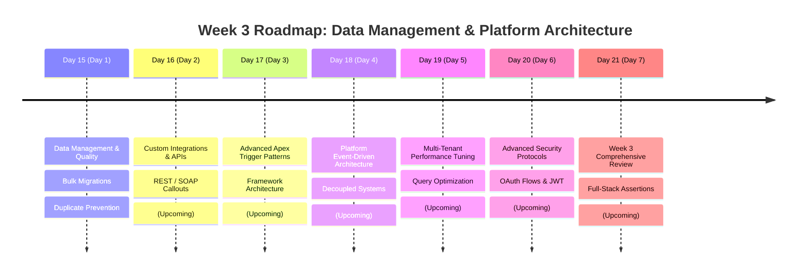

# Week 3 Summary: Data Management, Integrations, and Enterprise Architecture

Welcome to **Week 3** of the Salesforce Training Program. This week focuses on **Enterprise Data Stewardship, External Integrations, Advanced Apex Patterns, and production scalability**. We transition from basic platform mechanics to mastering how data is migrated, secured, integrated with third-party networks, and optimized for high-volume transactions.

Below is an architectural breakdown of the learning path, modules, and hands-on designs completed during this phase of the program.

---

## 📅 Day-by-Day Learning Log

---

### 🔹 [Day 15 (Day 1): Data Management & Data Quality](file:///c:/Users/kundu/OneDrive/Desktop/salesforce-training/WEEK-3/DAY-1/README.md)
*   **Core Focus**: Transitioning systems to strict data hygiene, bulk data migration planning, and duplication preventions.
*   **Key Concepts**:
    *   **Data Quality Rules**: Designing matching rules and duplicate rules to prevent database pollution and double-billing discrepancies.
    *   **Salesforce Data Loader**: Harnessing desktop Bulk APIs to coordinate massive insert, update, upsert, and delete operations.
    *   **Data Migration Architecture**: Mapping unstructured legacy spreadsheets (Excel) into relational Salesforce objects using External IDs.
    *   **Data Governance Policy**: Defining strict corporate standards to safeguard academic, contact, and financial transaction records.

---

### 🔹 Day 16 (Day 2): Custom Integrations & APIs *(Upcoming)*
*   **Core Focus**: Connecting Salesforce to external web services and third-party systems.
*   **Planned Concepts**:
    *   **REST/SOAP Web Services**: Building custom HTTP Apex Callouts and REST API endpoints.
    *   **JSON Parsing & Mocking**: Structuring callout payloads and writing unit test HTTP mock responses.

---

### 🔹 Day 17 (Day 3): Advanced Apex Trigger Patterns *(Upcoming)*
*   **Core Focus**: Designing trigger frameworks for enterprise scalability.
*   **Planned Concepts**:
    *   **Trigger Handler Pattern**: Moving logic out of raw triggers into reusable service classes.
    *   **Order of Execution**: Tracing the comprehensive transaction lifecycle from validation to commit.

---

### 🔹 Day 18 (Day 4): Platform Event-Driven Architecture *(Upcoming)*
*   **Core Focus**: Constructing reactive, decoupled, event-driven integrations.
*   **Planned Concepts**:
    *   **Platform Events**: Publishing and subscribing to real-time events over a centralized enterprise bus.
    *   **Reactivity**: Handling high-volume messaging without active UI blocking.

---

### 🔹 Day 19 (Day 5): Performance Tuning & Optimization *(Upcoming)*
*   **Core Focus**: Accelerating query and transaction execution speeds in multi-tenant environments.
*   **Planned Concepts**:
    *   **SOQL Performance**: Writing optimized indexing queries and avoiding nested loops.
    *   **Governor Limits Safeguards**: Preventing CPU timeouts and heap space failures under bulk loads.

---

### 🔹 Day 20 (Day 6): Advanced Security Protocols *(Upcoming)*
*   **Core Focus**: Securing integrations and user authentications.
*   **Planned Concepts**:
    *   **OAuth 2.0 & Connected Apps**: Configuring secure authentication handshakes.
    *   **Named Credentials**: Storing web service passwords and authentication certificates safely.

---

### 🔹 Day 21 (Day 7): Comprehensive Integration Review *(Upcoming)*
*   **Core Focus**: Asserting full-stack integrity and executing final review tests.
*   **Planned Concepts**:
    *   **End-to-End Testing**: Writing compound unit tests verifying integrations, triggers, validations, and flows in a unified context.
